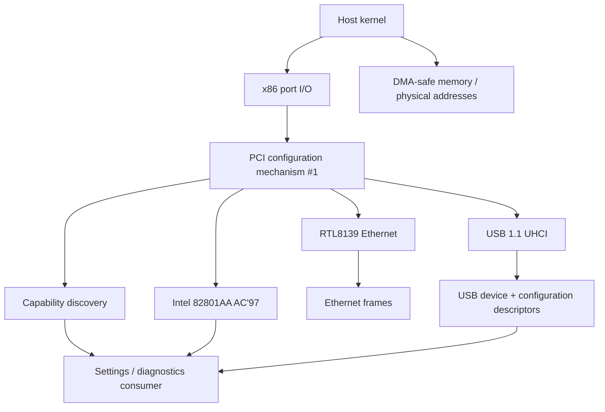

# Architecture

MortHardware is split into discovery, controller drivers, and protocol helpers. The source is deliberately small enough to study while retaining the real register and DMA operations used by MortOS.

## Discovery

`hardware.mx` walks PCI bus 0 across 32 device slots and all 8 functions. It classifies Ethernet, wireless/network-other, audio, and USB controllers from the class/subclass fields. This is capability discovery, not proof that a matching device has a working driver.

## RTL8139

`rtl8139.mx` uses PCI BAR0 port I/O. It enables PCI bus mastering, resets the NIC, configures a 9728-byte receive area around an 8 KiB wrapping ring, and maintains four transmit descriptors. The device performs DMA directly against the driver's global buffers.

`endian.mx` and `ethernet.mx` contain the byte-order and Ethernet-frame helpers needed by the driver's diagnostic frame. MortOS itself adds ARP, IPv4, ICMP, UDP, DHCP, DNS, TCP, and HTTP in its main repository.

## AC'97

`ac97.mx` currently targets PCI vendor/device `8086:2415`, the Intel 82801AA AC'97 controller emulated by QEMU. It discovers the mixer and bus-master BARs, enables I/O and bus mastering, establishes a 48 kHz front-DAC rate, controls stereo attenuation, and submits a one-entry buffer descriptor list for a PCM test tone.

## UHCI

`uhci.mx` finds PCI class `0x0c/0x03` with programming interface `0x00`. It resets the host and root port, constructs a 4 KiB-aligned 1024-entry frame list, and runs control transfers through one queue head and transfer descriptors.

The current boot sequence is:

1. Read the first 8 bytes of the device descriptor at address 0.
2. Assign USB address 1.
3. Read the complete 18-byte device descriptor.
4. Read the configuration header and then up to 64 bytes of the configuration tree.
5. Parse the first interface and its interrupt/bulk endpoint descriptors.
6. Issue `SET_CONFIGURATION` using the advertised configuration value.
7. For a HID boot interface, issue `SET_PROTOCOL(0)` and poll interrupt-IN reports.

HID keyboard reports are translated from USB usage IDs to XT set-1 make codes so an existing PS/2-style kernel dispatcher can consume both input paths. New key presses, Shift modifiers, arrows, editing keys, and F1–F12 are supported; typematic repeat and LED output are not yet implemented.

HID boot-mouse reports publish signed relative X/Y movement and left/right/middle button bits. The reusable framebuffer example saves the pixels below a 12×18 cursor before drawing it and restores them before movement. MortOS additionally routes left clicks to launcher tiles and Settings sections.

The current implementation enumerates both UHCI root ports into an eight-entry address/device table. A class-9 hub is configured through its hub descriptor, port power, port status, reset, and change-feature requests; connected downstream devices receive their own addresses. Keyboard and mouse bindings retain independent addresses, endpoints, speed flags, and data toggles.

Every two seconds the polling path checks UHCI root connection-change bits and known hub-port connection/change status. A change triggers a guarded full-bus rescan that rebuilds the device table and HID/Bluetooth bindings. A manual `usb_rescan()` entry point exposes the same recovery path to Settings. Root keyboard and hub-connected mouse detach/reattach are covered by QEMU assertions.

Hub traversal is currently one level deep. Transfer completion is polled using bounded delays, and there is no scheduler concurrency, incremental detach/address allocator, general HID report parser, or general class-driver transfer layer yet.

## Bluetooth USB HCI

A configured interface matching class/subclass/protocol `e0/01/01` is treated as a Bluetooth USB controller. The parser records its interrupt event endpoint and bulk ACL endpoints. Mort sends the mandatory three-byte HCI Reset command as a class control transfer on endpoint 0 and polls the interrupt endpoint for a matching Command Complete event. `g_bt_hci_ready` becomes true only when that event reports status zero.

This transport path compiles and passes absent-device regressions, but QEMU has no standard emulated Bluetooth USB controller. It remains explicitly unverified on a controller; discovery, pairing, L2CAP, security, and profiles are not claimed.

## PC speaker

The speaker helper programs PIT channel 2 and controls the speaker gate through port `0x61`. It is independent of PCI and AC'97.

## State publication

The drivers publish compact globals such as `g_usb_ok`, `g_usb_vid`, `g_usb_interface_class`, `g_ac97_ok`, and `g_rtl_ok`. MortOS Settings reads these values and invokes driver-owned service entry points such as `usb_rescan()`; it never writes controller registers directly.
